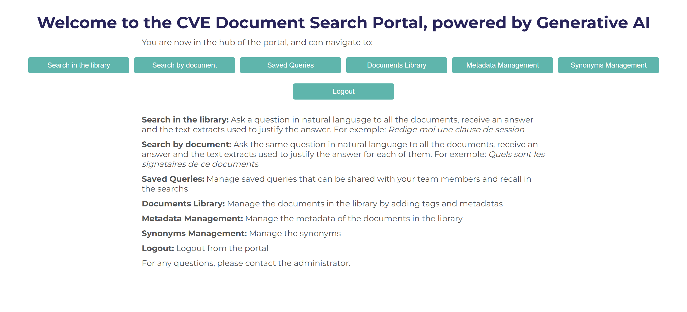
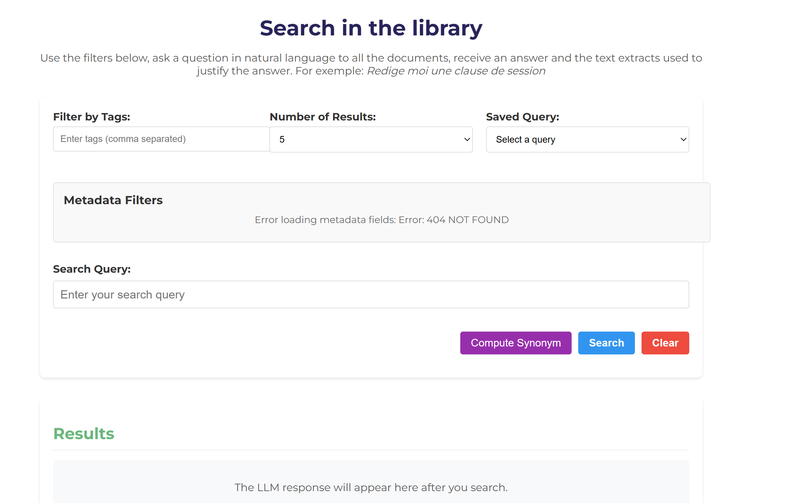
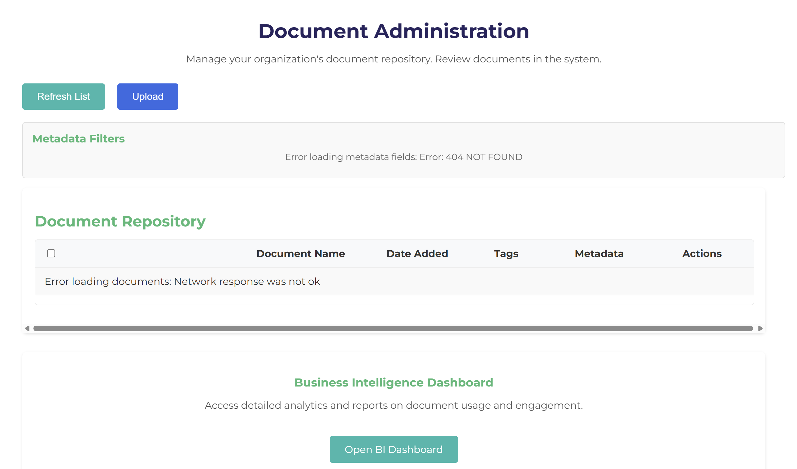
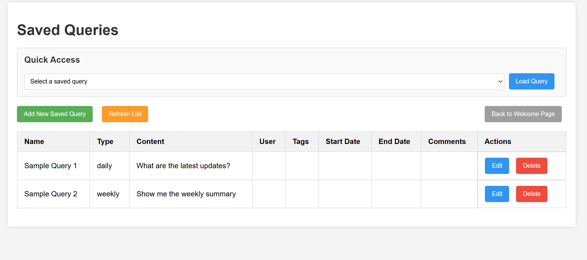

# Web_Service_RAG

This repository contains a web service that utilizes Retrieval-Augmented Generation (RAG) to provide enhanced responses by integrating external knowledge sources.

The specific goal is to create a web service that leverages RAG techniques to improve the quality and relevance of code documentation and other text-based outputs.

## Features

- **Retrieval-Augmented Generation**: Combines traditional language generation with retrieval of external knowledge to improve response accuracy and relevance.
- **Knowledge Integration**: Integrates information from various sources, allowing for more informed and context-aware responses.
- **API Access**: Provides an API for easy integration with other applications and services.
- **Web Service**: Uses AWS API Gateway, RDS, and Lambda for easy access and scalability. Deployed with Elastic Beanstalk.

## Quick Start - Local Development

To run a local version of the application for development and testing:

1. Clone the repository:

   ```bash
   git clone https://github.com/yourusername/Web_Service_RAG.git
   cd Web_Service_RAG/frontend_secure
   ```

2. Create a Python virtual environment and activate it:

   ```bash
   python -m venv venv
   .\venv\Scripts\activate  # On Windows
   source venv/bin/activate # On Unix/macOS
   ```

3. Install the required dependencies:

   ```bash
   pip install -r requirements.txt
   ```

4. Run the local development server:

   ```bash
   python app_local.py
   ```

5. Access the application at `http://localhost:5001`

## Application Screenshots

### Home Page


_Landing page of the application_

### Search Interface



Ask a question in natural language to all the documents, receive an answer and the text extracts used to justify the answer. For exemple: Redige moi une clause de session.

### Document Management


Manage the documents in the library by adding tags and metadatas, upload new documents or delete old ones.

### Recurrent Queries


Manage saved queries that can be shared with your team members and recalled in the searches.

## Deployment

For detailed deployment instructions, refer to our deployment guides:

- [AWS Elastic Beanstalk Deployment](documentation/deployment/README_ELASTIC_BEANSTALK.md)
- [AWS Lambda Setup](documentation/deployment/RUST_LAMBDA.md)
- [S3 CORS Configuration](documentation/deployment/s3_cors.md)

The application uses several AWS services for production deployment:

- **Frontend**: AWS Elastic Beanstalk
- **Backend**: AWS Lambda with Rust
- **Database**: AWS RDS (PostgreSQL)
- **Authentication**: AWS Cognito
- **Storage**: AWS S3
- **API**: AWS API Gateway
