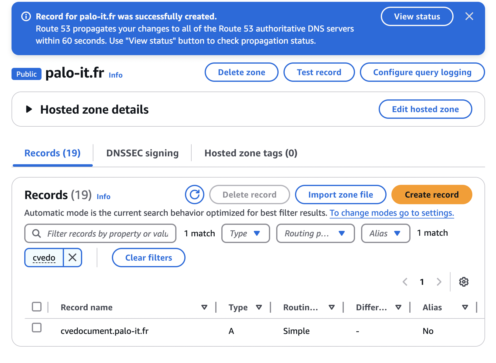
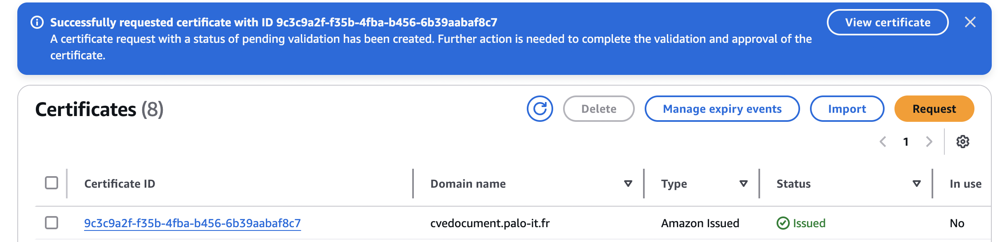
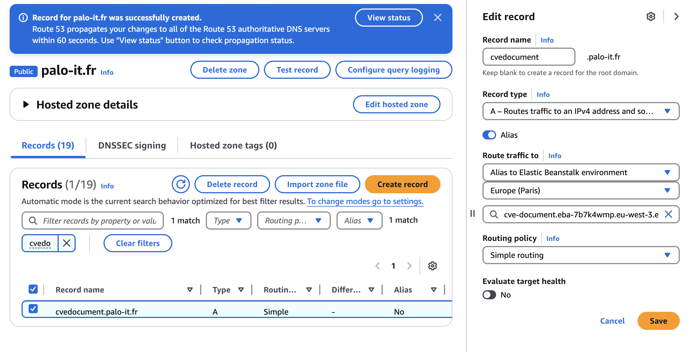
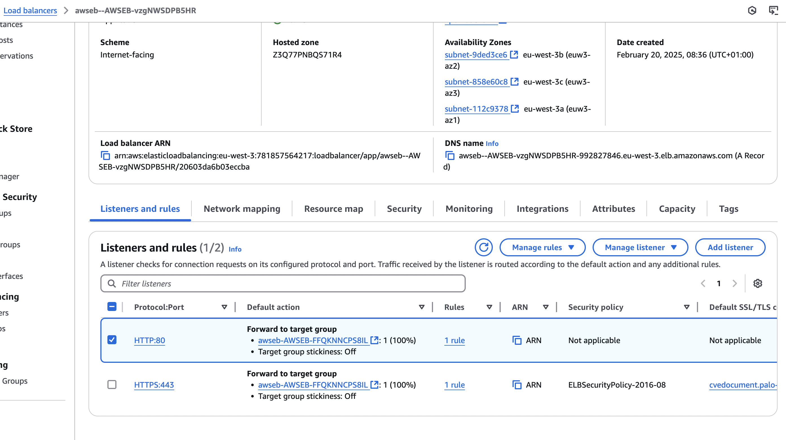
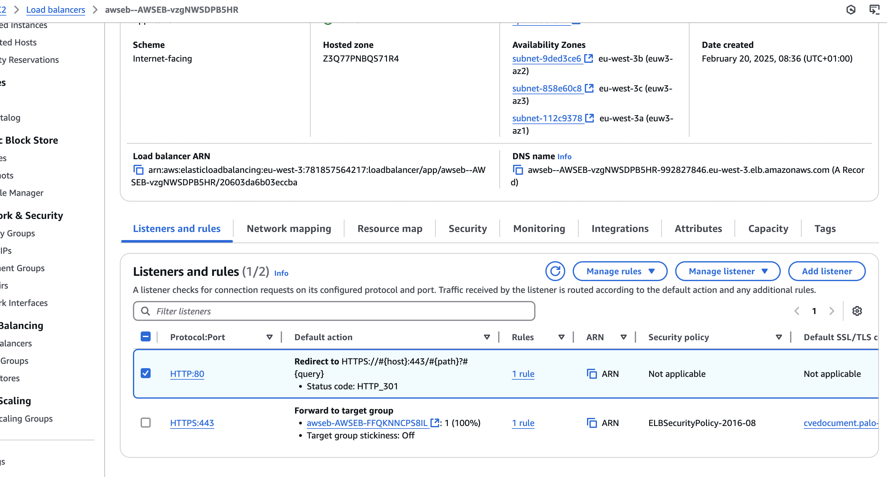
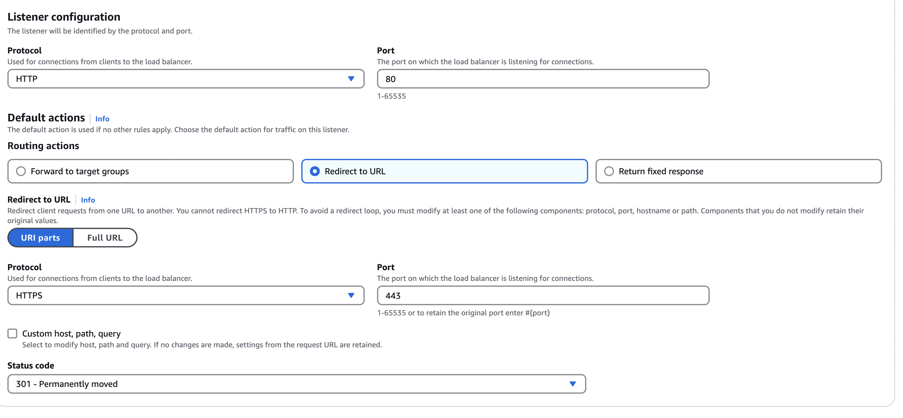

# Documentation

## deploy a flask app on elastic beanstalk
https://docs.aws.amazon.com/elasticbeanstalk/latest/dg/create-deploy-python-flask.html

## Launch template
https://docs.aws.amazon.com/elasticbeanstalk/latest/dg/environments-cfg-autoscaling-launch-templates.html

## HTTPS on EBT
https://repost.aws/knowledge-center/elastic-beanstalk-https-configuration

https://docs.aws.amazon.com/elasticbeanstalk/latest/dg/configuring-https-elb.html#configuring-https-elb.security-group

https://docs.aws.amazon.com/elasticloadbalancing/latest/APIReference/API_RedirectActionConfig.html

https://docs.aws.amazon.com/elasticbeanstalk/latest/dg/eb3-cmd-commands.html


## RDS
https://testdriven.io/blog/flask-elastic-beanstalk/


# Pre-requisite

## Install aws eb CLI
```bash
brew install awsebcli
```

# Creation of the application
Create the virual env
```bash
python3 -m venv pycvefront
source ./pycvefront/bin/activate
```

If needed to deactivate
```bash
deactivate
```

Add the packages
```bash
pip install --upgrade pip
pip install flask
pip install dotenv
pip install flask_cognito_lib
```


Then pip freeze to see the packages installed
```bash
pip freeze
```

then requirements.txt
```bash
pip freeze > requirements.txt
```
# Dev the application

BE CARREFULL THE APP MUST BE NAMED APPLICATION!!!!!!! SEE THE FILES 

# Run the app locally
```bash
python3 application.py
```

# Deployement

## LB, Certificate, and domain

The Domain and certificate mus be created separatly.
The LB must the be updated to rerout the 80 to the 443 manually.

### Create the domain



### Create the certificate



### init and deploy the app 

Follow the instruction. Do not forget to get the arn of the certificate and the domain name

## Optional for initialise the key (I've Used INNOVATION)
```bash
eb init
```

## Initialize the eb repository (BE CAREFULL OF THE ZONE)

```bash
eb init -p python-3.12 cve-document --region eu-west-3 
```

## create the app

```bash
eb create cve-document
```

## Link the certificate, the domain, and in the app via route53



## Update the port 80 to 443 in the LB

It's not yet possible to do it (2025-02-20) in the conf files. You must do it manually

Change the default 80 rule:


to:


By:



## Deploy the app and updatebthe configuation

```bash 
eb deploy
```

## upgrade the environment
```bash
eb upgrade
```

## Status of the app
```bash 
eb status
```

## Terminate the app
```bash
eb terminate cve-document
```

